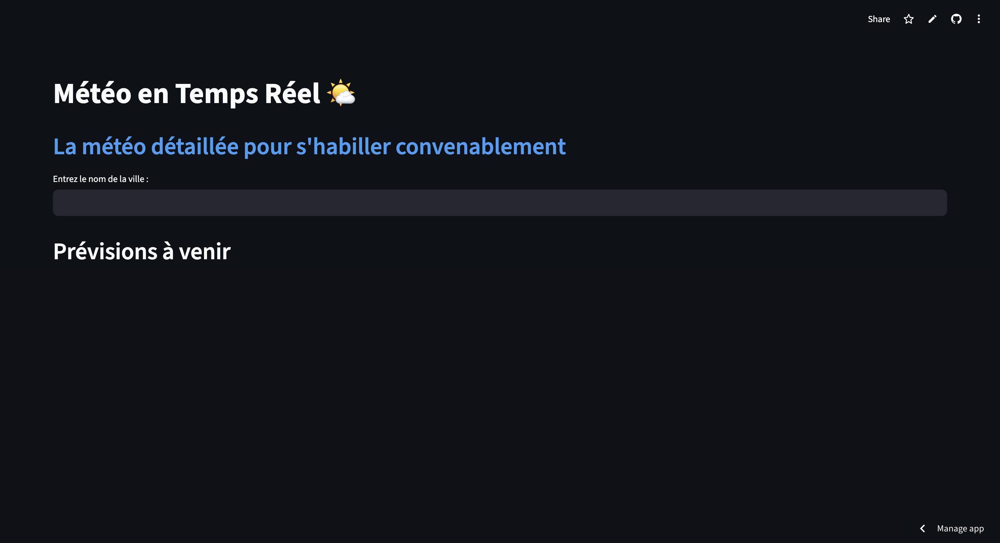

# 🌤️ Application Météo Professionnelle

> Application web interactive de visualisation météorologique avec analyses avancées et cartographie en temps réel.


---

## 📋 Description

Application météo développée avec **Streamlit** qui offre des prévisions météorologiques détaillées sur 4 jours avec visualisations interactives, analyses statistiques automatiques et cartographie en temps réel.

### ✨ Fonctionnalités principales

- 🌍 **Recherche mondiale** : Météo pour n'importe quelle ville
- 📊 **Visualisations avancées** : Graphiques de température, pression et précipitations
- 🗺️ **Carte interactive** : Couches météo superposées qui permet de voir la pluie en tps réel (Google Maps + OpenWeatherMap)
- 📈 **Analyses automatiques** : Statistiques et recommandations intelligentes
- 🎨 **Design moderne** : Interface sobre
- 🇫🇷 **Interface française** : Dates et unités localisées

---

## 🛠️ Technologies utilisées

### Langages & Frameworks
- **Python 3.8+**
- **Streamlit** - Framework web pour applications data science
- **Pandas** - Manipulation et analyse de données
- **Matplotlib** - Visualisation de données
- **Folium** - Cartographie interactive
-  **Datetime** - Manipulation des dates

### APIs & Services
- **OpenWeatherMap API** - Données météorologiques en temps réel
- **Google Maps** - Fond de carte

---

## 📦 Installation

### Prérequis
```bash
Python 3.8 ou supérieur
pip (gestionnaire de paquets Python)
```

### Étapes d'installation

1. **Cloner le repository**
```bash
git clone https://github.com/votre-username/meteo-app.git
cd meteo-app
```

2. **Installer les dépendances**
```bash
pip install streamlit pandas matplotlib seaborn folium streamlit-folium requests
```

3. **Configurer l'API Key**
- Créer un compte sur [OpenWeatherMap](https://openweathermap.org/api)
- Obtenir une clé API gratuite
- Remplacer `API_KEY` dans `app_meteo.py`

4. **Lancer l'application**
```bash
streamlit run app_meteo.py
```

L'application sera accessible sur `http://localhost:8501`

---

## 🎓 Compétences développées

### 1. 🔌 API REST & Données en temps réel
- Appels HTTP avec `requests`
- Manipulation de données JSON
- Gestion des erreurs et codes de statut
- Parsing de timestamps

**Exemple :**
```python
response = requests.get(BASE_URL, params=params)
data = response.json()
temperature = data["main"]["temp"]
```

### 2. 📊 Pandas - Manipulation de DataFrames
- Création de DataFrames à partir de dictionnaires
- Filtrage et sélection de colonnes
- Application de fonctions (`.apply()`, `.map()`)
- Formatage conditionnel
- Styling de DataFrames

**Exemple :**
```python
df = pd.DataFrame(toutes_les_previsions)
df_display["Température"] = df["Température"].apply(lambda x: f"{x}°C")
```

### 3. 📈 Matplotlib - Visualisation de données
- Graphiques en ligne (`plot`)
- Diagrammes en barres (`bar`)
- Personnalisation (couleurs, grilles, labels)
- Thème sombre (`dark_background`)
- Multi-graphiques

**Types de graphiques créés :**
- **Line plot** : Évolution des températures
- **Line plot** : Évolution de la pression
- **Bar plot** : Précipitations sur 3h

### 4. 🎨 Streamlit - Interface utilisateur
- Configuration de page (`st.set_page_config`)
- Layout en colonnes (`st.columns`)
- Widgets interactifs (`st.text_input`)
- Métriques (`st.metric`)
- Messages conditionnels (`st.warning`, `st.success`, `st.info`)
- Thèmes personnalisés (config.toml)

**Exemple de layout :**
```python
col1, col2 = st.columns(2)
with col1:
    st.dataframe(df)
with col2:
    st.pyplot(fig)
```

### 5. 🗺️ Folium - Cartographie interactive
- Création de cartes centrées
- Marqueurs personnalisés
- Couches superposées (layers)
- Popups et tooltips
- Contrôle des couches
- Intégration avec Streamlit

**Couches météo disponibles :**
- Température
- Précipitations
- Nuages

### 6. 🤖 Analyses automatiques
- Calculs statistiques (moyenne, min, max, somme)
- Logique conditionnelle complexe
- Génération de recommandations
- Messages contextuels

**Analyses effectuées :**
- Température moyenne sur 4 jours
- Pluviométrie totale
- Recommandations vestimentaires
- Alertes météo

---

## 📸 Captures d'écran

### Vue principale


### Graphiques et analyses


### Carte interactive


---

## 🎨 Personnalisation

### Thème sombre
Configuration dans `.streamlit/config.toml` :
```toml
[theme]
primaryColor = "#4FC3F7"
backgroundColor = "#0f2027"
secondaryBackgroundColor = "#1E3A5F"
textColor = "#E8F4F8"
```

### Modifier les seuils de température
Dans le code, section analyses automatiques :
```python
if temp_moyenne < 10:
    st.info("Il va faire froid !")
elif temp_moyenne < 15:
    st.info("Temps frais")
```

---

## 🚀 Améliorations futures

- [ ] Historique des recherches
- [ ] Comparaison entre plusieurs villes
- [ ] Export des données en CSV
- [ ] Graphiques Plotly interactifs
- [ ] Notifications par email
- [ ] Prévisions sur 10 jours
- [ ] Mode clair/sombre toggle
- [ ] Multi-langues

---

## 📝 Structure du projet
```
meteo-app/
├── app_meteo.py           # Application principale
├── .streamlit/
│   └── config.toml        # Configuration du thème
├── requirements.txt       # Dépendances Python
├── README.md             # Documentation
└── screenshots/          # Captures d'écran
```

---

## 🤝 Contribution

Les contributions sont les bienvenues ! N'hésitez pas à :
1. Fork le projet
2. Créer une branche (`git checkout -b feature/amelioration`)
3. Commit les changements (`git commit -m 'Ajout fonctionnalité'`)
4. Push vers la branche (`git push origin feature/amelioration`)
5. Ouvrir une Pull Request

---

## 📄 Licence

Ce projet est sous licence MIT. Voir le fichier `LICENSE` pour plus de détails.

---

## 👨‍💻 Auteur

**Halim**
- Portfolio : [votre-portfolio.com](https://votre-portfolio.com)
- LinkedIn : [votre-linkedin](https://linkedin.com/in/votre-profil)
- GitHub : [votre-github](https://github.com/votre-username)

---

## 🙏 Remerciements

- [OpenWeatherMap](https://openweathermap.org/) pour l'API météo
- [Streamlit](https://streamlit.io/) pour le framework
- La communauté Python pour les excellentes bibliothèques

---

## 📊 Statistiques du projet

- **Lignes de code** : ~400
- **Temps de développement** : 1 journée
- **Technologies** : 6
- **Graphiques** : 3
- **Features** : 8

---

*Projet réalisé dans le cadre du développement d'un portfolio Data Analyst* 🚀
